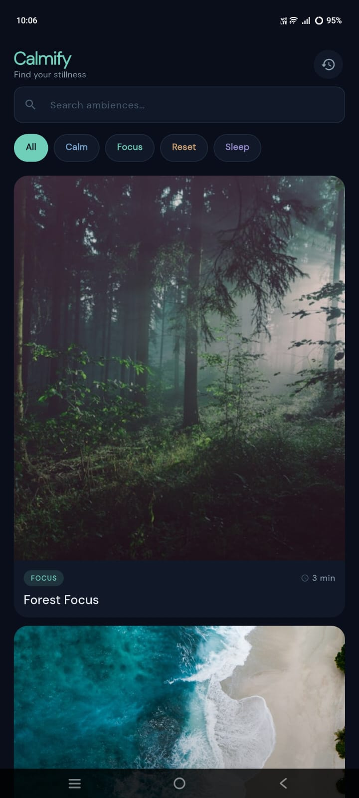
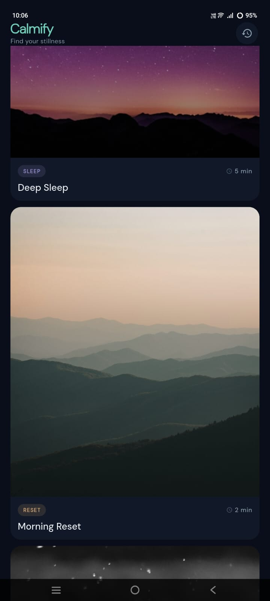
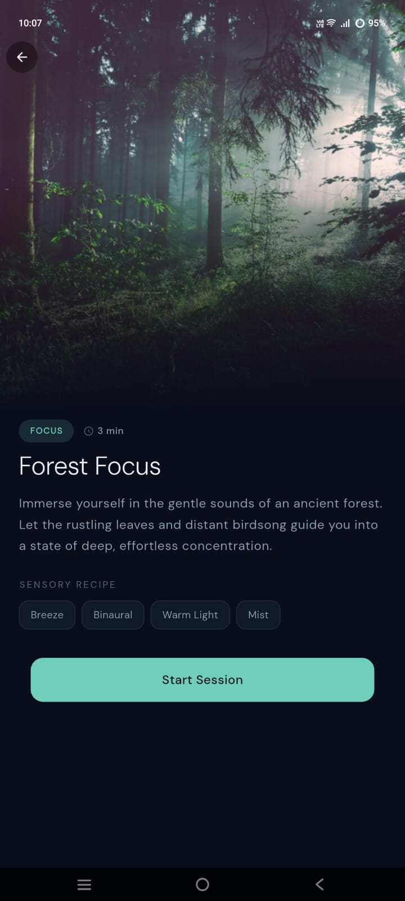
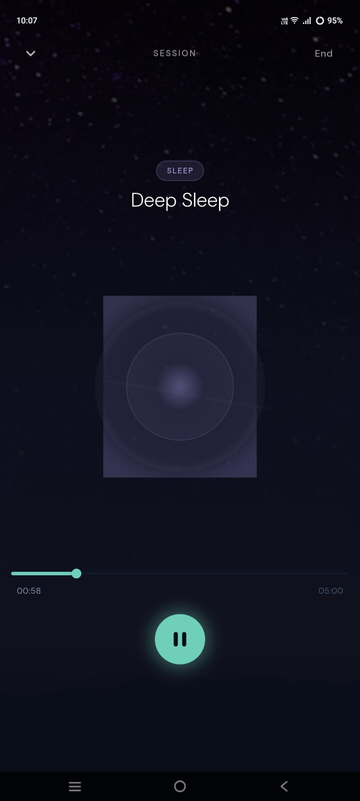
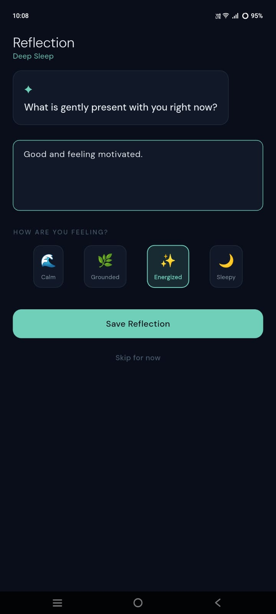
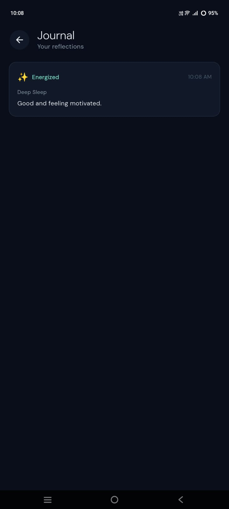
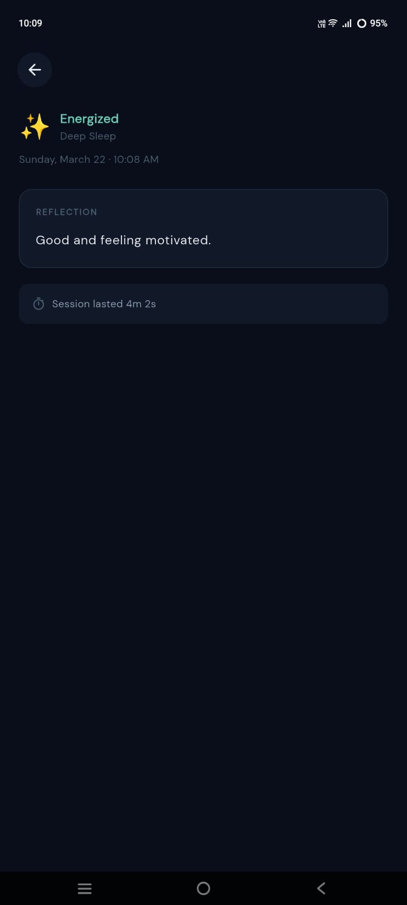

# 🧘 Calmify — Mindfulness & Ambient Sound App

Calmify is a modern mindfulness and ambient sound application designed to help users relax, refocus, and reset their mental state through short, immersive sessions.

It is built as a lightweight alternative to apps like Calm and Endel, with a focus on quick mental resets for students, developers, and busy individuals.

---

## 🌿 Core Idea

Calmify allows users to:

- Select a calming ambience  
- Start a timed session with looping background audio  
- Follow a breathing animation  
- Reflect on their emotional state after the session  

---

## 🔄 App Flow

### 1. Browse Ambiences
- Curated environments (Forest, Ocean, Night, etc.)  
- Tagged by intent: *Focus, Calm, Sleep, Reset*  

### 2. Start Session
- Ambient audio plays in the background  
- Breathing animation guides relaxation  
- Timer-based session control  

### 3. Complete Session
- Session ends automatically or manually  

### 4. Reflection Journal
- Prompt:  
  *"What is gently present with you right now?"*  

- Mood selection:
  - Calm  
  - Grounded  
  - Energized  
  - Sleepy  

### 5. Session History
- Track past sessions  
- View reflections and moods over time  

---

## ✨ Key Features

- 🎧 Ambient sound environments  
- 🌊 Smooth breathing animation  
- ⏱️ Customizable session timer  
- 📓 Built-in reflection journaling  
- 📊 Session history tracking  
- 🎯 Minimal, distraction-free UI  

---

## 🛠️ Tech Stack

- Flutter (UI Framework)  
- Dart  
- Audio playback integration  
- Local storage (for session history)  

---

## 📸 Showcase

### 🏠 Home & Discovery

  
  
  

### 🎧 Session Experience

  
  

### 📊 Tracking & Journal

  
  

---

## ⚠️ Note

> Full source code is kept private. This repository is intended to showcase the UI/UX design, features, and overall product concept.

---

## 🚀 Vision

Calmify is built from a personal vision to help individuals improve their focus, mental clarity, and daily growth through mindful breaks.

In a world full of distractions, the goal of Calmify is simple — to provide a space where users can pause, reset their mind, and return stronger to their work.

It is designed especially for students, developers, and creators who want to build consistency, increase focus hours, and maintain a calm, balanced mindset while working toward their goals.

---

## 🔮 Future Improvements

- AI-based mood insights  
- Personalized ambience recommendations  
- Cloud sync  
- Advanced analytics dashboard  
